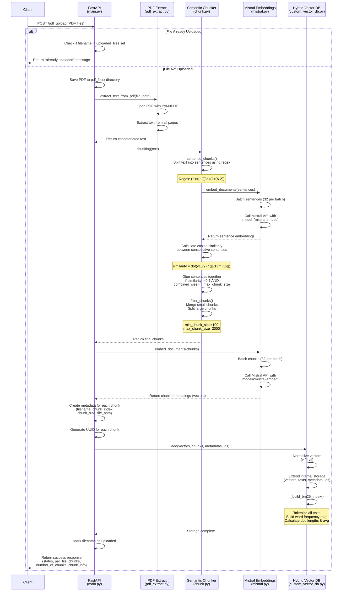
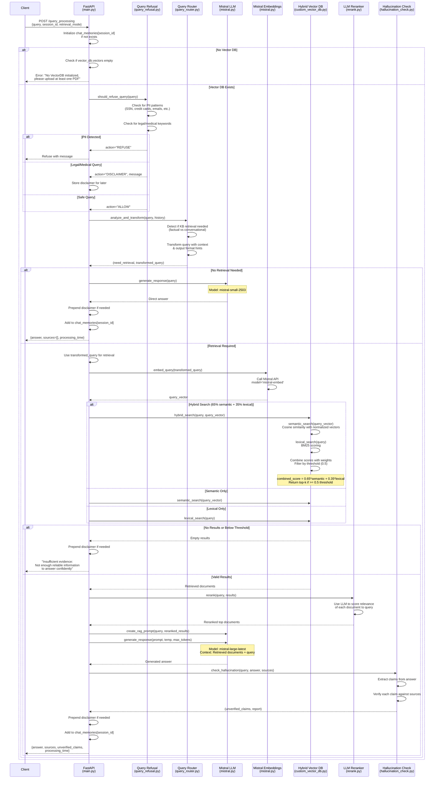

# RAG Pipeline with Mistral AI

A Retrieval-Augmented Generation (RAG) pipeline for PDF documents, featuring hybrid search (Semantic + BM25), semantic chunking, LLM reranking, hallucination detection, and query safety policies.

## Features

- **PDF Ingestion**: Upload and process multiple PDF files with semantic chunking
- **Hybrid Search**: Combines semantic (vector similarity) and lexical (BM25) search
- **Custom Vector Database**: No external vector DB dependencies
- **Query Intelligence**:
  - Intent detection and query routing (Checks if query needs retrieval)
  - Query transformation for better retrieval
  - PII detection with hard refusal
  - Legal/medical disclaimers
- **Answer Quality**:
  - LLM-based reranking
  - Chat memory support
  - Hallucination detection (LLM based)
  - Insufficient evidence handling 
  - Answer shaping (lists, steps, comparisons) (Transforming query to request the intended)
- **Modern UI**: React-based chat interface with source citations

## Prerequisites

Before you begin, ensure you have the following installed:

- **Python 3.11 or higher** - [Download Python](https://www.python.org/downloads/)
- **Node.js 18+ and npm** - [Download Node.js](https://nodejs.org/)
- **uv** (Python package manager) - [Install uv](https://github.com/astral-sh/uv)
- **Mistral AI API Key** - [Get API Key](https://docs.mistral.ai/)

## Installation & Setup

### 1. Clone the Repository

```bash
git clone <repository-url>
cd RAG_Pipeline
```

### 2. Backend Setup

#### Step 2.1: Install uv (if not already installed)

```bash
# macOS/Linux
curl -LsSf https://astral.sh/uv/install.sh | sh

# Windows
powershell -c "irm https://astral.sh/uv/install.ps1 | iex"
```

#### Step 2.2: Navigate to Backend Directory

```bash
cd backend
```

#### Step 2.3: Create Virtual Environment and Install Dependencies

```bash
# Create virtual environment and install dependencies
uv sync

# Activate the virtual environment
# On macOS/Linux:
source .venv/bin/activate
# On Windows:
.venv\Scripts\activate
```

#### Step 2.4: Configure Environment Variables

Create a `.env` file in the `backend` directory:

```bash
cd backend
cp app/env.example .env
```

Edit the `.env` file and add your Mistral API key:

```env
mistral_api_key="your_mistral_api_key_here"
```
### 3. Frontend Setup

#### Step 3.1: Navigate to Frontend Directory

```bash
cd ../frontend  # From backend directory
# OR
cd frontend     # From root directory
```

#### Step 3.2: Install Dependencies

```bash
npm install
```

## Running the Application

You'll need **two terminal windows** - one for the backend and one for the frontend.

### Terminal 1: Start the Backend Server

```bash
cd backend
source .venv/bin/activate  # Activate virtual environment (macOS/Linux)
# OR
.venv\Scripts\activate     # Windows

# Start the FastAPI server
uvicorn app.main:app --reload --host 0.0.0.0 --port 8000
```

The backend API will be available at `http://localhost:8000`

### Terminal 2: Start the Frontend Server

```bash
cd frontend
npm run dev
```

The frontend UI will be available at `http://localhost:5173`

## Usage

### 1. Upload PDF Files

1. Open your browser to `http://localhost:5173`
2. Click the **"Select PDFs"** button
3. Choose one or more PDF files to upload
4. Wait for the files to be processed and chunked

### 2. Ask Questions

1. Once PDFs are uploaded, type your question in the input field
2. Press **Enter** or click **"Ask"**
3. The system will:
   - Analyze your query intent
   - Transform the query with added context like chat memory
   - Search through the knowledge base (if needed)
   - Generate an answer with source citations
   - Check for hallucinations and point out unverified claims
   - List, define or compare as intended

### Example Queries

- **Factual**: "What are the main findings in the document?"
- **List-based**: "What are the benefits of this approach?" (automatically formatted as a list)
- **Step-by-step**: "How do I implement this process?" (formatted as steps)
- **Conversational**: "Hello, how are you?" (doesn't trigger retrieval)

## Project Structure

```
RAG_Pipeline/
├── backend/
│   ├── app/
│   │   ├── main.py                 # FastAPI application and endpoints
│   │   ├── mistral.py              # Mistral AI integration (embeddings & LLM)
│   │   ├── ingestion/
│   │   │   ├── pdf_extract.py      # PDF text extraction
│   │   │   └── chunk.py            # Semantic chunking algorithm
│   │   ├── storage/
│   │   │   └── custom_vector_db.py # Hybrid vector database (BM25 + semantic)
│   │   ├── retrieval/
│   │   │   └── rerank.py           # LLM-based reranking
│   │   └── tools/
│   │       ├── query_router.py     # Intent detection & query transformation
│   │       ├── query_refusal.py    # PII detection & legal/medical disclaimers
│   │       └── hallucination_check.py # Answer verification
│   ├── pyproject.toml              # Python dependencies
│   └── pdf_files/                  # Uploaded PDFs storage
├── frontend/
│   ├── src/
│   │   ├── App.jsx                 # React application
│   │   ├── main.jsx                # Entry point
│   │   └── styles.css              # Styling
│   └── package.json                # Node dependencies
└── README.md
```

## Libraries Used

### Backend
- **[FastAPI](https://fastapi.tiangolo.com/)** - Modern Python web framework
- **[Mistral AI](https://docs.mistral.ai/)** - Embeddings and LLM
- **[PyMuPDF](https://pymupdf.readthedocs.io/)** - PDF text extraction
- **[NumPy](https://numpy.org/)** - Vector operations
- **[Uvicorn](https://www.uvicorn.org/)** - ASGI server

### Frontend
- **[React 18](https://react.dev/)** - UI framework
- **[Vite](https://vite.dev/)** - Build tool
- **[React Markdown](https://github.com/remarkjs/react-markdown)** - Markdown rendering

## Architecture Diagrams

### PDF Upload Pipeline

The following diagram illustrates the complete workflow of the `/pdf_upload` endpoint, from receiving a PDF file to storing it in the vector database:



### Query Processing Pipeline

The following diagram shows the complete RAG query processing flow with safety checks, intelligent routing, and hallucination detection:



## Key Design Decisions

### Semantic Chunking
- Splits text into sentences, measures cosine similarity between consecutive sentences
- Merges similar sentences (threshold > 0.7) into coherent chunks
- Maintains chunk size: 100-2000 characters for optimal retrieval

### Hybrid Search
- **65% semantic** (vector similarity) + **35% lexical** (BM25)
- Minimum similarity threshold: 0.5 to ensure quality results
